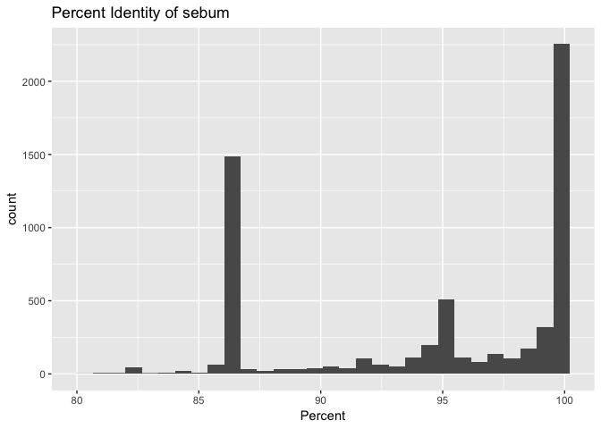
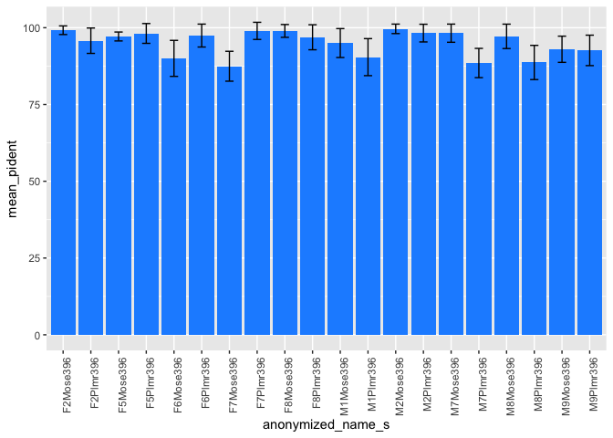
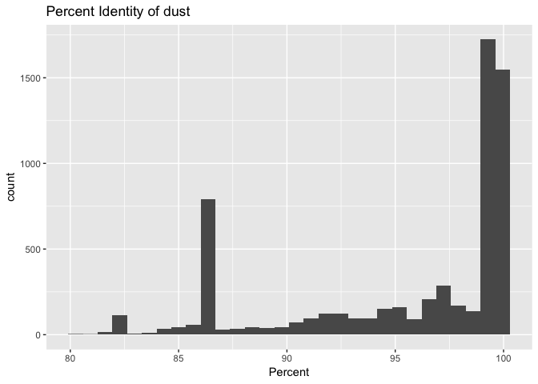
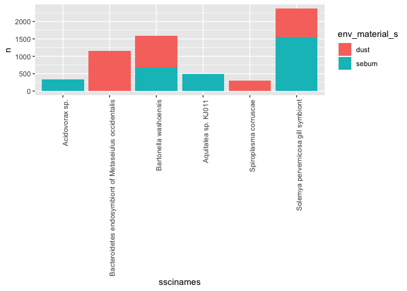

Analysis of BLAST Results to Determine a Forensic Identification Method
================
Kailie Dela Cruz
October 9, 2018

Introduction
============

On Earth today, there are about one trillion species of microorganisms, such as bacteria, surrounding us. While we have a general idea of the *amount* of microorganisms around us, about 99.999% of them are actually unknown. Even though there is much more to learn about the bacteria that surrounds us, the current information about species that we do know are still able to be applied to very significant aspects that we deal with each day. As bacteria can be found all around us, one of these aspects include the correlation between what can be found on the palms of our hands and the things that we touch. In a study done, it stated that "the diversity of skin-associated bacterial communities is far higher than previously recognized, with a high degree of interindividual variability in the composition of bacterial communities" (Fierer et al., 2010.) In more detail, in this study, the researchers analyzed recuperated skin bacteria from surfaces that were touched in comparison to the skin bacteria that were found on the hands that had touched such surfaces. It was hypothesized that skin bacteria left on objects can be compared to bacteria found on the actual skin surface that originally touched the object which can be used as a form of forensic identification. The results of their study proved that they were able to match the object to the human individual that had touched it through the use of a "high-throughput pyrosequencing-based approach".

According to Kausar Malik and Nabiha Naeem in a research article, majority of the isolated pathogenic microorganisms that are found on computer keyboards and computer mice included E. Coli, Salmonella, Shigella and Staphylococcus (2014.) Giving a brief summary about the bacteria seen in Fierer's study compared to the results studied in the research article, common species found included Staphylococcus succinus, Solemya pervenicosa gill symbiont, and Pinus massoniana.

Methods
=======

Sample origin and sequencing
----------------------------

The hypothesis of the study stated that bacteria found on touched objects can be compared to bacteria found on the hands that had touched the objects to use as a form of forensic identification. To conduct this research, objects such as computer mice and the corresponding human hands, both female and male, were analyzed. Because bacteria can be readily recovered from surfaces even if they had been untouched for 2 weeks at room temperature, the structure of the bacterial communities were used to compare the computer mice handled by different people. More specifically, sebum material was analyzed in terms of the samples of the human palms because this is commonly found on skin. According to a journal article titled "Sebaceous gland lipids," the sebaceous glands secrete sebum which is a complex mixture of lipids. Though the ultimate role of human sebum is far from being completely understood, it is proven to correspond to components that assist the skin with protection (Picardo et al.) With the samples of the computer mice on the other hand, dust was looked at more closely to study the bacterial communities.

In order to quantitatively compare the bacterial communities between the computer mice and the human palms to determine the matching of the object to the individual, the study used a high-throughput pyrosequencing based approach. Pyrosequencing can be seen similar to Sanger sequencing except for the fact that it uses the detection of pyrophosphate release and the formation of light on nucleotide additions rather than chain termination using dideoxynucleotides.

Computational
-------------

After the actual conducting of the experiment using sebum and dust to gather information about the bacterial communities on objects and individuals' palms, I analyzed the found data computationally. I downloaded the list of files that contained the information about the samples studied, which I then used to create QC reports of each file. These FastQC reports provided information of the files in terms of basic statistics, per base sequence quality, per sequence quality scores, per base sequence content, per sequence GC content, per base N content, sequence length distribution, sequence duplication levels, overrepresented sequences, adapter content and kmer content. After running the FastQC reports, I trimmed the sequences in each file based on their quality scores. The importance of trimming sequences is the fact that if they are not trimmed, the sequence can be distorted and affect the downstream sequence analysis as well. Trimming is one of the first steps in analyzing new generation sequencing data because with DNA sequencers, poor quality reads are particularly found near the primer and toward the end of the longer sequence runs. After trimming the sequences, I converted fastq files to fasta files as the next step required the data from fasta files specifically. This next step that required fasta files is BLASTing. In this final step, I BLASTed the data which allowed me to search for the top match of each sequence against the nucleotide database. With the end result information gathered after trimming, converting and BLASTing the files, I looked at the data more closely by sorting found bacteria by its five most common species. Through this, the bacteria species found between human palms and computer mice were compared.

Results
=======

``` r
# Be sure to install these packages before running this script
# They can be installed either with the install.packages() function
# or with the 'Packages' pane in RStudio

# load packages
library("dplyr")
library("tidyr")
library("knitr")
library("ggplot2")
```

``` r
# Output format from BLAST is as detailed on:
# https://www.ncbi.nlm.nih.gov/books/NBK279675/
# In this case, we used: '10 sscinames std'
# 10 means csv format
# sscinames means unique Subject Scientific Name(s), separated by a ';'
# std means the standard set of result columns, which are:
# 'qseqid sseqid pident length mismatch
# gapopen qstart qend sstart send evalue bitscore',


# this function takes as input a quoted path to a BLAST result file
# and produces as output a dataframe with proper column headers
# and the 'qseqid' column split into sample and seq number
read_blast_output <- function(filename) {
  data_in <- read.csv(filename,
                      header = FALSE, # files don't have column names in them
                      col.names = c("sscinames", # unique Subject Sci Name(s)
                                    "qseqid",    # Query Seq-id
                                    "sseqid",    # Subject Seq-id
                                    "pident",    # Percntge of identical matches
                                    "length",    # Alignment length
                                    "mismatch",  # Number of mismatches
                                    "gapopen",   # Number of gap openings
                                    "qstart",    # Start of alignment in query
                                    "qend",      # End of alignment in query
                                    "sstart",    # Start of alignment in subj
                                    "send",      # End of alignment in subject
                                    "evalue",    # Expect value
                                    "bitscore"))  # Bit score

  # Next we want to split the query sequence ID into
  # Sample and Number components so we can group by sample
  # They originally look like "ERR1942280.1"
  # and we want to split that into two columns: "ERR1942280" and "1"
  # we can use the separate() function from the tidyr library to do this
  # Note that we have to double escape the period for this to work
  # the syntax is
  # separate(column_to_separate,
  # c("New_column_name_1", "New_column_name_2"),
  # "seperator")
  data_in <- data_in %>%
    separate(qseqid, c("sample_name", "sample_number"), "\\.")
}
```

``` r
# this makes a vector of all the BLAST output file names, including
# the name(s) of the directories they are in
files_to_read_in <- list.files(path = "output/blast",
                               full.names = TRUE)

# We need to create an empty matrix with the right number of columns
# so that we can rbind() each dataset on to it
joined_blast_data <- matrix(nrow = 0,
                            ncol = 14)

# now we loop over each of the files in the list and append them
# to the bottom of the 'joined_blast_data' object
# we do this with the rbind() function and the function we
# made earlier to read in the files, read_blast_output()
for (filename in files_to_read_in) {
  joined_blast_data <- rbind(joined_blast_data,
                             read_blast_output(filename))
}
```

``` r
# Next we want to read in the metadata file so we can add that in too
# This is not a csv file, so we have to use a slightly different syntax
# here the `sep = "\t"` tells the function that the data are tab-delimited
# and the `stringsAsFactors = FALSE` tells it not to assume that things are
# categorical variables
metadata_in <- read.table(paste0("data/metadata/",
                                 "fierer_forensic_hand_mouse_SraRunTable.txt"),
                          sep = "\t",
                          header = TRUE,
                          stringsAsFactors = FALSE)

# Finally we use the left_join() function from dplyr to merge or 'join' the
# combined data and metadata into one big table, so it's easier to work with
# in R the `by = c("Run_s" = "sample_name")` syntax tells R which columns
# to match up when joining the datasets together
joined_blast_data_metadata <- metadata_in %>%
  left_join(joined_blast_data,
            by = c("Run_s" = "sample_name"))
```

**Figure 1**

``` r
# Here we're using the dplyr piping syntax to select a subset of rows matching a
# criteria we specify (using the filter) function, and then pull out a column
# from the data to make a histogram.
joined_blast_data_metadata %>%
  filter(env_material_s == "sebum") %>%
  ggplot(aes(x = pident)) +
    geom_histogram() +
    ggtitle("Percent Identity of sebum") +
    xlab("Percent")
```

    ## `stat_bin()` using `bins = 30`. Pick better value with `binwidth`.



**Figure 2**

``` r
# Group by anonymized name and calculate the mean percent identity
joined_blast_data_metadata %>%
  group_by(anonymized_name_s) %>%
  summarize(mean_pident = mean(pident),
            sd_pident = sd(pident)) %>%
  ggplot(aes(x = anonymized_name_s,
             y = mean_pident)) +
  geom_col(fill = "dodger blue") +
  geom_errorbar(aes(ymax = mean_pident + sd_pident,
                    ymin = mean_pident - sd_pident),
                width = 0.3) +
  theme(axis.text.x = element_text(angle = 90,
                                   hjust = 1))
```



**Figure 3**

``` r
# Here we're using the dplyr piping syntax to select a subset of rows matching a
# criteria we specify (using the filter) function, and then pull out a column
# from the data to make a histogram.
joined_blast_data_metadata %>%
  filter(env_material_s == "dust") %>%
  ggplot(aes(x = pident)) +
    geom_histogram() +
    ggtitle("Percent Identity of dust") +
    xlab("Percent")
```

    ## `stat_bin()` using `bins = 30`. Pick better value with `binwidth`.



**Figure 4**

``` r
joined_blast_data_metadata %>%
  group_by(sscinames, env_material_s) %>%
  tally() %>%
  arrange(desc(n)) %>%
  filter(n > 300) %>%
  ggplot(aes(x = sscinames,
             y = n,
             fill = env_material_s)) +
  geom_col() +
  theme(axis.text.x = element_text(angle = 90,
                                   hjust = 1))
```



**Table 1**

``` r
# Finally, we'd like to be able to make a summary table of the counts of
# sequences for each subject for both sample types. To do that we can use the
# table() function. We add the kable() function as well (from the tidyr package)
# in order to format the table nicely when the document is knitted
kable(table(joined_blast_data_metadata$host_subject_id_s,
            joined_blast_data_metadata$sample_type_s))
```

|     |  computer mouse|  right palm|
|-----|---------------:|-----------:|
| F2  |             396|         410|
| F5  |             365|         777|
| F6  |             662|         422|
| F7  |             655|         546|
| F8  |             878|         374|
| M1  |             456|         878|
| M2  |             670|         775|
| M7  |             970|         689|
| M8  |             717|         280|
| M9  |             571|         968|

The use of histograms, tables and graphs allowed me to analyze the acceptance or rejection of the hypothesis that the bacteria found on hands compared to the bacteria found on the surfaces touched by the hands can be used as forensic identification.

Figure 1 looks closely at the count of the percent identity of sebum in the samples, which as mentioned before, is a complex mixture of lipids that is found on human hands as a form of protection. The column titled "env\_material\_s" found in the metadata of this study gives us specfic information about the types of materials that are found on the samples studied. In further detail, the two types of materials seen were dust and sebum, where dust related to the computer mice and the sebum related to human hands. As this figure focuses strictly on env\_material\_s and the percent identity of sebum, we know that it is telling us how well certain tests were able to detect sebum material which was linked to human hands. Figure 1 shows high percent identities of above 80% for the samples analyzed.

The bar graph, or Figure 2, studied the mean percent identity compared to the sample names found in the anonymize\_name\_s column in the metadata. With the use of error bars, we were able to observe how accurate the results were. Mean percent identities, regardless of whether dust or sebum was being tested, were close to 100 in all anonymized name samples.

Similar to Figure 1, Figure 3 looks closely at the count of the percent identity of dust in the samples, which was related to computer mice. This histogram was also created using the env\_material\_s column found in the metadata, which gives us information about the types of material looked at with each sample. Focusing on dust, Figure 3 also shows count numbers from 0-200 with high percent identities of dust above 80%.

Figure 4 shows a comparison bar graph that looks at the amount of sebum vs. dust found in the specific bacteria species known as Acidovorax sp., Bacteroidetes endosymbiont of Metaseiulus occidentalis, Bartonella washoensis , Aquitalea sp. KJ011, Spiroplasma corruscae, and Solemya pervemicosa gill symbiont. Comparing the types of materials found in the species of bacterias can tell us where certain species of bacteria can be found. For example, if there is a higher count of sebum related to species A, then it is highly likely that this species was found on a human hand.

Table 1 is a summary table that provides information about the numbers of sequences of each subject for both sample types, the right palm and a computer mouse. While some subjects contain larger numbers of sequences for computer mice samples, others contain larger numbers of sequences for right palm samples. There are only a few subjects that contain sequence numbers within a 100 range of the sample types.

Discussion
==========

The figures created were strong evidence for our hypothesis. Figure 1 generally shows strong support for the hypothesis because in all of the samples observed, the percent identity of sebum was higher than 80%. Counts ranging from 0-2000 with high percent identities above 80% proves the fact that the data collected is reliable. This is because the sebum was the part of the hand that was being observed and so having a high amount of this means that the correct material was analyzed rather than another material that can be associated with different types of bacteria than normally seen. Like figure 1, figure 3 which looked closely at the percent identity of dust found on samples also shows strong support for the hypothesis for similar reasons. Specifically, with counts ranging from 0-2000 and high percent identities above 80%, there data collected was more accurate when studying computer mice. Continuing to look at percent identites in figure 2, high means of these numbers for the samples proves further accuracy of the materials that were being studied. Along with this, small error bars means less chance of inaccurate data. This ultimately leads to more accurate data collected overall as mentioned before.

Studying a factor other than percent identity of materials, figure 4 provided more information about the materials that were associated with different species of bacteria. While some species strictly contained a single material (dust only or sebum only), the species that contained both provided us with the idea that these are species that can lead us to a successful forensic identification method. This is because this may be the overlap that is necessary to show the relationship between the contacted surface and the hand that initially made contact. In further detail, if a specific species is found on a hand and the same species is found on a computer mouse, we can gain a stronger idea that the two things (hand and computer mouse) associated with this species of bacteria can be linked.

Studying larger sequence numbers of a certain sample types compared to the other (right palm vs. computer mouse) in each subject could have been due to the fact that a certain material was being looked at (dust vs. sebum). For example, if a subject dealt with sebum and the right palm, there would be a higher number of sequences of this sample type. However, equal amounts of sequence counts regardless of the material looked at could provide information that skews data or provides us with a different perspective that can alter data in general. Therefore, this table shows that there could be differen approaches to this study that can lead to different views on the subjects.

Overall, the figures above represent a strong case for the given hypothesis of this experiment. Collecting data of the accurate and necessary materials generally allows for the acceptance of the hypothesis. Also, with evidence that there are species of bacteria that are found on both human hands and computer mice, we can make further tests to verify which specific surfaces are exactly linked to eachother. This method of forensic identification, though can be improved, gives us a general idea of which human hands made contact with which computer mice. With a continuation in advancements, this method can be used to study forensics of other subjects as well.
